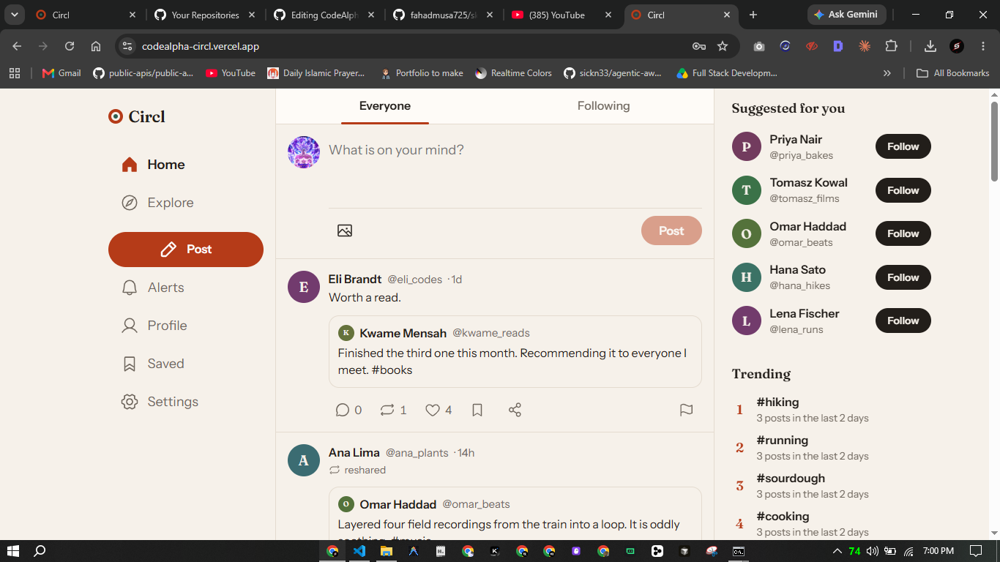
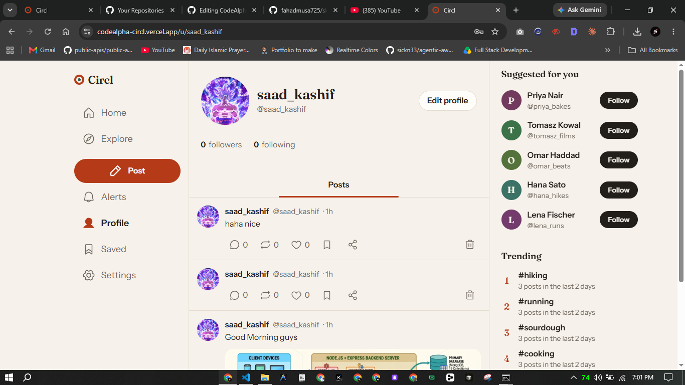
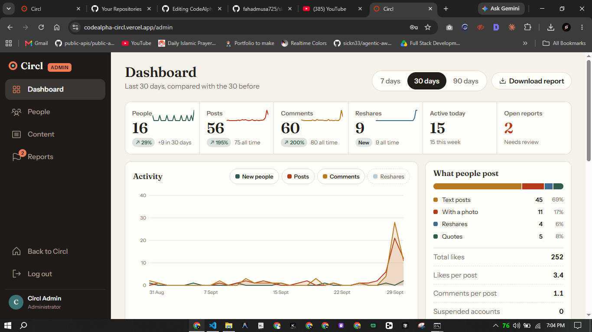
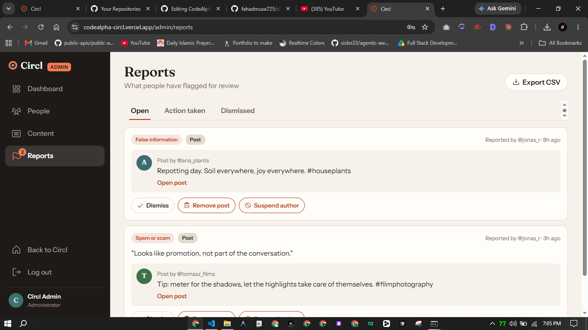
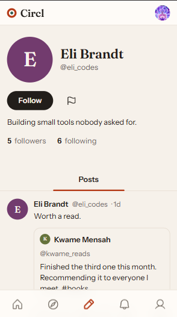
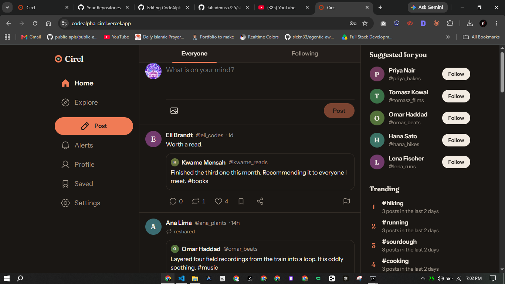

# Circl

> A full-stack social media platform built with the MERN stack.

> [!NOTE]
> CodeAlpha Internship - Task 2 (Full Stack Social Media Platform)

Circl is a content-first social web application where people share short posts and photos, follow each other, and keep up with what their circle is doing. It features a two-tab home feed (Everyone and Following), profiles, comments, likes, saved posts, resharing, trending hashtags, suggested people, live notifications, and a complete admin dashboard with reports and analytics. It supports dark and light mode and is fully responsive.

---


---

## Live Demo

> [Circl Social Platform](https://codealpha-circl.vercel.app/).

---

## Features

- JWT authentication with role-based access (user / admin), bcrypt password hashing, and sessions that end when the password changes
- Profiles with avatar, display name, bio, follower and following lists, and that person's posts
- Text posts (up to 500 characters) with an optional photo, uploaded straight to Cloudinary with signed requests
- Comments, likes, and saved posts
- Reshare a post or quote it with your own words, and share by device share sheet or copied link
- Home feed with Everyone and Following tabs, cursor-based pagination
- `#hashtags` that link to tag pages, plus trending hashtags from the last 48 hours
- Suggested people based on who your friends already follow
- Notifications for likes, comments, follows, reshares and quotes, with an unread badge that updates on its own
- Report any post or profile from the flag button
- Admin dashboard with its own sidebar and phone tab bar: key numbers with period-over-period change, an interactive activity chart (7 / 30 / 90 days), content mix, top posts and creators, popular hashtags, newest people, a reports queue (dismiss, remove post, suspend person), people and content management, an audit trail, and CSV exports
- Dark mode / light mode / system theme with no flash on load
- Fully responsive layout: bottom tab bar on phones, icon rail on tablets, labelled sidebar on laptops, suggestions column on wide screens
- Toast messages and in-app confirmation dialogs instead of browser popups
- Keyboard accessible, screen-reader friendly, WCAG 2 AA contrast

---

## Screenshots

| Home Feed | Profile | Admin Dashboard |
|---|---|---|
|  |  |  |

| Admin Reports | Mobile | Dark Mode |
|---|---|---|
|  |  |  |

---

## Tech Stack

**Frontend**
- React 19 + React Router v7
- Vite (build tooling)
- Redux Toolkit (auth, feed and notification state)
- Vanilla CSS with custom property design tokens (light and dark themes)
- Hand-built SVG charts for the admin dashboard
- Phosphor icons
- Axios with JWT interceptor

**Backend**
- Node.js + Express 5
- MongoDB Atlas + Mongoose ODM
- JWT authentication (jsonwebtoken + bcryptjs)
- Cloudinary (signed direct image uploads)
- Helmet and express-rate-limit for security

**Hosting**
- Vercel (client and API as two projects)

---

## Project Structure

```
Circl/
├── client/                  # React frontend (Vite)
│   ├── src/
│   │   ├── app/             # Redux store
│   │   ├── features/        # auth, feed, notification state
│   │   ├── components/      # Posts, composer, toasts, layout
│   │   ├── pages/           # One file per screen
│   │   ├── admin/           # Admin layout, charts and pages
│   │   ├── lib/             # API client, helpers
│   │   └── index.css        # Design system
│   └── index.html
└── server/                  # Express API
    ├── api/                 # Vercel serverless entry
    ├── scripts/             # Seed data and admin tools
    └── src/
        ├── models/          # User, Post, Comment, Notification, Report, AdminLog
        ├── controllers/     # Request handlers
        ├── middleware/      # Auth, rate limits
        └── routes/          # Express routers
```

---

## Running Locally

**Prerequisites:** Node.js 20+, a MongoDB Atlas URI, and a Cloudinary account (free tiers work).

**Backend**

```bash
cd server
cp .env.example .env        # fill in MONGODB_URI, JWT_SECRET, CLIENT_URL, CLOUDINARY_*
npm install
npm run dev                 # runs on http://localhost:5000
```

`JWT_SECRET` must be a random string of 32 or more characters.

**Frontend**

```bash
cd client
npm install
npm run dev                 # runs on http://localhost:5173
```

The dev server forwards `/api` requests to port 5000, so keep both terminals running.

**Demo data (optional)**

```bash
cd server
npm run seed                # sample people, posts, comments and reports
```

The demo login details are printed in the terminal. Do not run this against a production database.

**Create an admin (optional)**

Register a normal account, then promote it:

```bash
cd server
npm run make-admin -- you@example.com
```

---

Part of a 3-project internship submission for CodeAlpha. See also [Nexoria](https://github.com/code-with-saad/CodeAlpha_Nexoria) · [Huddle](https://github.com/code-with-saad/CodeAlpha_Huddle) · [Circl](https://github.com/code-with-saad/CodeAlpha_Circl)
